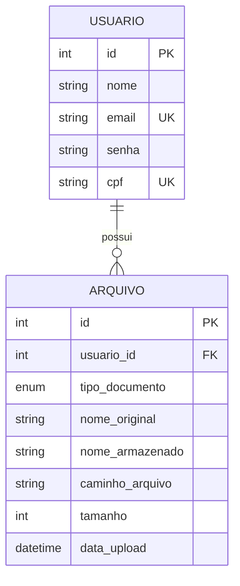

# Gerenciador de Documentos PDF por CPF

Este projeto é um sistema de gerenciamento de documentos digitais que permite o upload, organização, busca e edição de arquivos PDF vinculados a usuários via CPF. Desenvolvido para oferecer segurança, acessibilidade e uma interface intuitiva.

---

## Tecnologias Utilizadas

- **Front-end:** [Next.js](https://nextjs.org/) (React), HTML5, CSS3 (Styled JSX).
- **Back-end:** Node.js com rotas de API do Next.js.
- **Banco de Dados:** MySQL com ORM [Sequelize](https://sequelize.org/).
- **Segurança:** Autenticação via JWT (JSON Web Tokens) e Hash de senhas com Bcrypt.js.
- **Uploads:** Multer para processamento de arquivos multipart/form-data.

---

## Modelagem do Banco de Dados (Diagrama ER)

O sistema utiliza um banco de dados relacional com uma relação de 1:N (um usuário para muitos arquivos).

## Funcionalidades (CRUD)
- Create: Registro de novos usuários e upload de documentos PDF.

- Read: Busca de documentos filtrada por CPF do titular.

- Update: Alteração do tipo de documento (ex: de CPF para RG) após o envio.

- Delete: Remoção de arquivos do sistema e do banco de dados.

## Acessibilidade e Segurança
- Web Content Accessibility Guidelines (WCAG): Interface operável via teclado, uso de rótulos descritivos (aria-label) e contraste adequado.

- Segurança: Proteção de rotas privadas, expiração de tokens e armazenamento seguro de dados sensíveis.

## Instalação e Execução
- Clonar o repositório:
- git clone https://github.com/LuanAlmeiBandeira/Gerenciador-de-arquivos.git

- Instalar dependências:
- npm install

- Configurar o Banco de Dados: Certifique-se de que o MySQL está rodando e as credenciais no arquivo config/database.js estão corretas.

- Inicializar as Tabelas:
- npm run db:init

- Rodar o servidor de desenvolvimento:
- npm run dev 
- Acesse: http://localhost:3000

## Casos de Teste
- Consulte o arquivo TESTES.md para detalhes sobre a validação das funcionalidades